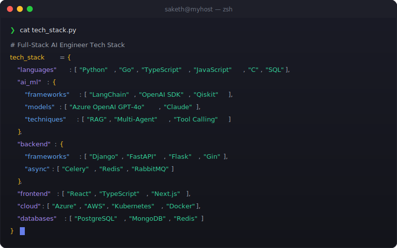

# Hi there, I'm Saketh Chandra 👋

**AI Software Engineer | 4+ Years Experience | Building Production AI Systems & Developer Tools**

---

## 🚀 About Me

I'm a **Full-Stack AI Software Engineer** with 4+ years of experience at **Honeywell**, where I build production-grade AI systems and internal developer tools that serve hundreds of engineering teams globally.

- 🔭 **Currently:** Software Development Engineer 2 (SD2) at Honeywell, leading AI agent development and full-stack engineering
- 🎯 **Expertise:** GenAI/LLM Systems, Multi-Agent Orchestration, RAG Architecture, Full-Stack Development, Backend Systems
- 🏆 **Impact:** Reduced incident resolution time by 60%, automated 10,435+ code defects, saved 1,000+ engineering hours annually
- 🌱 **Learning:** Advanced AI agent architectures, LLMOps, and distributed systems at scale
- 💼 **Open to:** AI/ML Engineering, Full-Stack Engineering, and Senior Backend Engineering roles
- 🎓 **Education:** B.Tech in Computer Science & Engineering, Amrita University (2022)

---

## 💡 Core Expertise

### **AI & Machine Learning**
- **GenAI Systems**: Multi-agent orchestration, LangChain, Azure OpenAI GPT-4o/4-turbo, RAG architectures
- **Production AI**: FastAPI microservices, vector databases (Qdrant), embeddings, tool-calling patterns
- **Security**: MCP servers, command whitelisting, injection prevention, RBAC-aware tooling
- **Specialties**: Autonomous incident resolution, code remediation, CI/CD troubleshooting agents

### **Backend Development & Infrastructure**
- **Distributed Systems**: Microservices architecture, async processing (Celery/Redis), message queues
- **Cloud & Containers**: Azure (AKS, ACR, ACI), Docker, Kubernetes, multi-region deployments
- **Developer Tools**: Self-service portals, automation workflows, CI/CD integration
- **Monitoring & APIs**: Prometheus, Grafana, REST APIs, WebSockets, real-time systems

### **Full-Stack Development**
- **Backend**: Python (Django, FastAPI), Go (Gin), REST APIs, WebSockets, OAuth2/MSAL
- **Frontend**: React, TypeScript, Next.js, micro-frontend architecture
- **Databases**: PostgreSQL, MongoDB, Redis, SQLAlchemy
- **Cloud**: Azure (AKS, ACR, ACI), AWS, Docker, Helm

### **Specialized Domains**
- **Quantum Computing**: Qiskit, IBM Quantum Experience, published research (Springer 2023)
- **WebAssembly**: C to WASM transpilation, Emscripten, FFI bridges
- **IoT**: Raspberry Pi, Arduino, embedded systems, HID devices

---

## 🏆 Key Achievements

### **At Honeywell (2022 - Present)**

#### **🤖 AI & Automation**
- **Multi-Agent SRE System**: Architected autonomous AI system processing 1,000+ monthly alerts across 3 regions, reducing P1/P2 incident resolution by **60%**
- **Coverity AI Agent**: Built LLM-powered code remediation system that processed **10,435+ defects**, generated **1,119 PRs**, achieving **30-40% developer adoption**
- **RAG-Based Help System**: Developed enterprise AI assistant indexing **4,500+ documents** for CI/CD troubleshooting, saving **140+ hours annually**
- **MCP Server Platform**: Architected Kubernetes-native platform hosting 4 AI integration services across multi-region AKS clusters

#### **🛠️ Full-Stack Development**
- **Kong Automation Portal**: Built self-service web application (Django/React) serving **150+ teams** with dual-platform API gateway management
- **Grafana Migration System**: Developed automated dashboard migration tool reducing deployment time by **95%** (10 hours → 30 minutes)
- **AlertOps Portal**: Engineered multi-region alert management web app with **100% uptime** since Aug 2023, serving 10-15 teams
- **AKS Management Platform**: Architected full-stack Kubernetes resource management application, eliminating **140+ manual hours annually**

#### **👥 Leadership & Mentorship**
- Led and mentored **2 full-time engineers** (direct reports) within global software development organization
- Established coding standards and onboarding playbooks for team of 10+ engineers
- Drove adoption of Python best practices and microservices architecture across division

---

## 🔬 Featured Projects

### [**RayDoom**](https://www.npmjs.com/package/raydoom-core) - WASM Gaming Engine (2025)
Architected a dual-package WebAssembly platform that transpiles **67,000+ lines of C code** to run DOOM within Raycast launcher
- **Tech**: C, WebAssembly, Emscripten, TypeScript, React, Node.js
- **Highlights**: Real-time ASCII rendering at 15 FPS, custom memory management, 500MB heap monitoring
- **Published**: [raydoom-core on npm](https://www.npmjs.com/package/raydoom-core)

### [**QuantumRNG**](https://pypi.org/project/QuantumRNG/) - Quantum Random Number Generator (2021-2023)
Developed algorithm for true random number generation using quantum computing with single qubit
- **Tech**: Python, Qiskit, IBM Quantum Experience, Azure Quantum
- **Published**: Springer Conference, 2023 ([DOI: 10.1007/978-981-19-7126-6_10](https://doi.org/10.1007/978-981-19-7126-6_10))
- **Available**: [QuantumRNG on PyPI](https://pypi.org/project/QuantumRNG/)

### [**PicoWiFiDucky**](https://github.com/Saketh-Chandra/PicoWiFiDucky) - Wireless HID Device (2023)
Built WiFi-enabled HID device for penetration testing using Raspberry Pi Pico W
- **Tech**: Raspberry Pi Pico W, MicroPython, WiFi, Web Interface
- **Features**: Remote keyboard input execution, web-based payload delivery

### [**GTA SA Save Game Editor**](https://github.com/Saketh-Chandra/GTA_SA_Save_Game_EditorPy) - Web-Based Game Modding (2022-2023)
Created browser-based save game editor for GTA San Andreas
- **Tech**: React, Pyscript, JavaScript, Binary File Parsing
- **Features**: Real-time game state modification, health/money/weapons editing

---

## 🛠️ Tech Stack

  

<b>📋 Complete Tech Stack (Click to expand)</b>

 

**Languages:** Python • Go • TypeScript • JavaScript • C • SQL

**AI/ML:** LangChain • OpenAI SDK • Google ADK • Azure OpenAI GPT-4o • GPT-4-turbo • Claude • Qiskit • RAG • Multi-Agent • Tool Calling • Fine-tuning • Qdrant • Chroma • Pinecone

**Backend:** Django • FastAPI • Flask • Gin • REST APIs • GraphQL • WebSockets • gRPC • Celery • Redis • RabbitMQ • OAuth2 • JWT • MSAL • Azure AD

**Frontend:** React • Next.js • TypeScript • Redux • Context API • Tailwind CSS • Material-UI • Bootstrap

**Cloud & DevOps:** Azure (AKS, ACR, ACI) • AWS • GCP • Docker • Kubernetes • Helm • GitHub Actions • Octopus Deploy • Azure DevOps

**Monitoring:** Prometheus • Grafana • ELK Stack • Victoria Metrics

**Databases:** PostgreSQL • MongoDB • Redis • MySQL • SQLite

**ITSM:** ServiceNow • PagerDuty • Jira • Confluence

**Specialized:** Qiskit • IBM Quantum Experience • Azure Quantum • Emscripten • WebAssembly • C/C++ • Raspberry Pi • Arduino • MQTT • MicroPython

---

## 📊 GitHub Stats

  
  

  

---

## 📜 Certifications & Recognition

- **IBM Quantum Challenge 2021** - Intermediate Achievement (June 2021)  
  _Demonstrated proficiency in quantum circuit decomposition, Shor's algorithm, QE correction, and Qiskit Pulse_

- **Introduction to Quantum Computing** - Qubit by Qubit (April 2021)  
  _First global quantum computing course partnered with IBM Quantum, taught by MIT and Oxford researchers_

- **Published Research** - Springer Conference (2023)  
  _"QuantumRNG: Random Number Generator Using Quantum Computing" - DOI: 10.1007/978-981-19-7126-6_10_

- **Multiple Bravo Awards** - Honeywell (2022-2026)  
  _Recognition for exceptional engineering contributions and impact_

---

## 🎓 Education & Leadership

**Bachelor of Technology, Computer Science and Engineering**  
Amrita School of Engineering, Bengaluru | Aug 2018 - May 2022

**Leadership Roles:**
- **Google DSC-ASEB** - Technical Member (Sept 2020 - July 2021)
- **Amrita ROVER Team** - Software Engineer Lead (Jan 2020 - 2021)  
  _Led Rover Internal Servers and Ground Station development; Team ranked 6th at IRDC 2020_

---

## 💼 Currently Seeking Opportunities

I'm actively exploring opportunities in:
- **AI/ML Engineering** - LLM applications, agent systems, RAG architectures
- **Full-Stack Engineering** - Internal tools, web applications, developer productivity
- **Senior Backend Engineering** - Distributed systems, microservices, APIs
- **Software Engineering** - Production systems, scalable applications, automation

**Location:** Bengaluru, India | Open to Remote & Relocation

---

## 📫 Get In Touch

- 💼 **LinkedIn:** [linkedin.com/in/saketh-chandra](https://linkedin.com/in/saketh-chandra/)
- 📧 **Email:** [b.sakethchandra9@gmail.com](mailto:b.sakethchandra9@gmail.com)
- 🐦 **Twitter:** [@Saketh_Chandra_](https://twitter.com/Saketh_Chandra_)
- 💻 **HackerRank:** [Profile](https://www.hackerrank.com/b_sakethchandra9)
- 📝 **Dev.to:** [sakethchandra](https://dev.to/sakethchandra)

---

  
### "Building AI systems that solve real problems, one agent at a time" 🤖

⭐ **Star my repositories if you find them interesting!**

